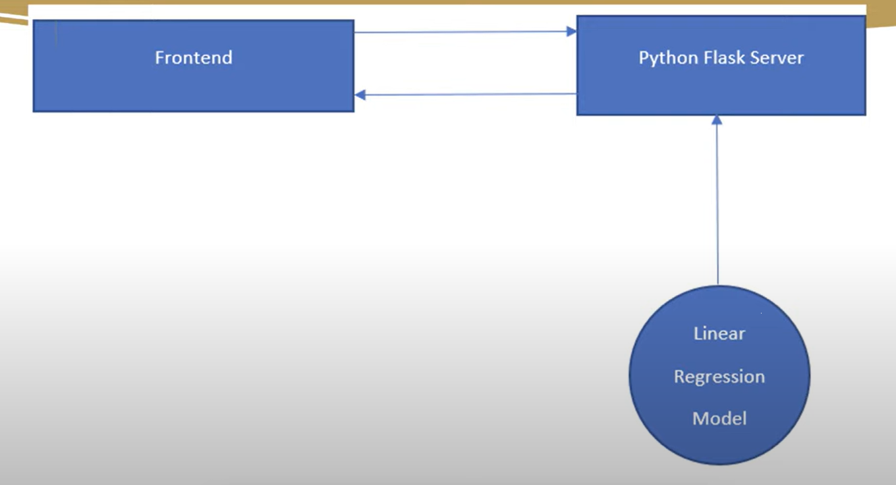

# student-attendance-system-SSD
python
mo hinh ssd
react
asp .net core web api
# Model SSD
 + Các model chính trong network SSD : vgg (Có thể là model khác), extras, location, confidence
 location : sub network => 8732 offset  của bbox => Có thông tin của bbox 
 => đầu ra là [1, 8732, 4]
 confidence : thì là độ tự tin nhận diện  đầu ra là [1, 8732, 21], 21 là số lượng class 
 
# Build backend server
+ Xây dựng backend server bằng flask : pip install flask and pip install flask-cors
    - Flask : Xây dựng web app (api backend, ui...IOT)
    - CORS là một cơ chế cho phép nhiều tài nguyên khác nhau của một trang web có thể truy vấn domain khác với domain của trang đó
    - SSL Flask : cho phép bật SSL cho backend để đảm bảo an toàn dữ liệu => mã hóa thông tin
    - Database cài : pip install -U Flask-SQLAlchemy
 